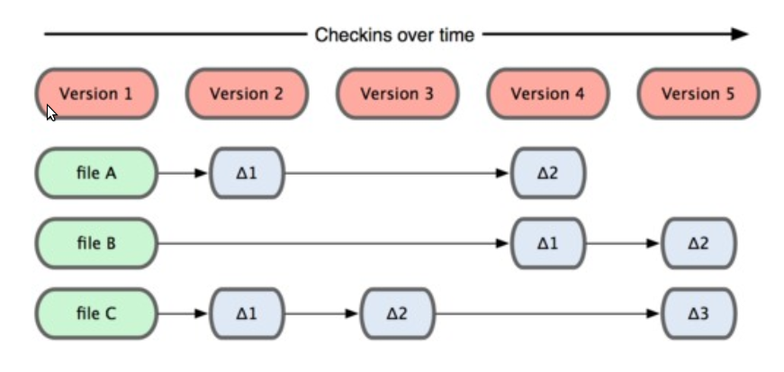
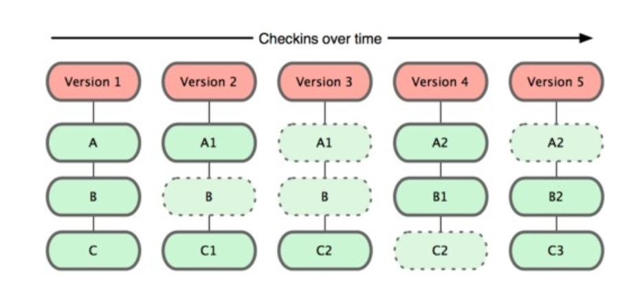
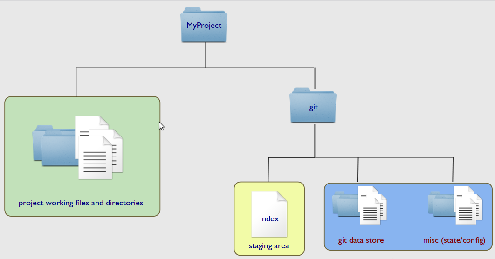

TOSAN tech talk
===
####Learn git the hard way  
######by Amin Hejazi

!

Concepts
===
* Simple design 
* Is designed around its DATA structure
* Takes Snapshot instead of Storing differences
* Project structure
* Integrity by design

!

Storage Difference
===

!

Storage Difference
===

!

Project Structure
===

!

Coding
===
* Obj-C is nice
* Think of it like a VERY simple layer of OO on top of C
* Much simpler than C++
* Like JS with C syntax

!

Time and Motivation
===
* I spend a few hours a week on it
* Motivated by family/house
* Dont be scared to give it a go

!

Support
===
* I have my email in most apps
* Get maybe one a day?
* Everyone is friendly
* I gave one refund

!

Fail forwards
===
* Most apps fail
* < $5 / week = fail
* So: Make lots of small apps
* Build on what works eg usage
* Remember rovio made 51 apps before angry birds.

!

Ideas
===
* Start with crummy ideas. Thats better than nothing.
* If it's 'obvious' to you, then its probably useful to someone.
* Execution > ideas anyway.

!

Marketing
===
* Tried free for a week - fail (800 -> 0)
* I have websites for my apps - nothing
* Tried $2 - nothing, except usage apps
* Now I just plonk them on at $1 or $2 and leave it
* Haven't tried adwords

!

Nuts n bolts
===
* Reviews take 2 weeks
* Apple takes 30%
* GST is 10%
* Marginal tax will take 37% of what remains
* Put it in the wife's name!
* Ads in apps make nothing

!

Ideas
---
* Pair up, make two apps, one in each name to make revenue split simple
* Android - never touched. Get in the ground floor on tablets?
* Scratch your own itch - make a very simple app

!

Whats stopping you?
---
Any questions?
